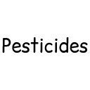

# Pesticides

Little silly mod I made for me and my friends.
This is literally food poisoning simulator but like in Minecraft idk.

You can create a faucet, put pesticide in it, and it'll make plants grow faster in a **5x3x5 blocks radius**.
By shift clicking, you can put it in **double mode**, allowing you to have pesticide applied in both directions (not just in front of the faucet),
but **its pesticide consumption will double**. It has a radius of **5x5x5 blocks**

## Food poisoning

Yes, you can poison food !
Just put a pesticide container next to any food in a crafting table and it will **poison it** !

How cool is that

## JEI Integration

There's basic integration with jei for crafts.
It's very recommended to use it with this mod because some recipes won't appear in the recipe book !